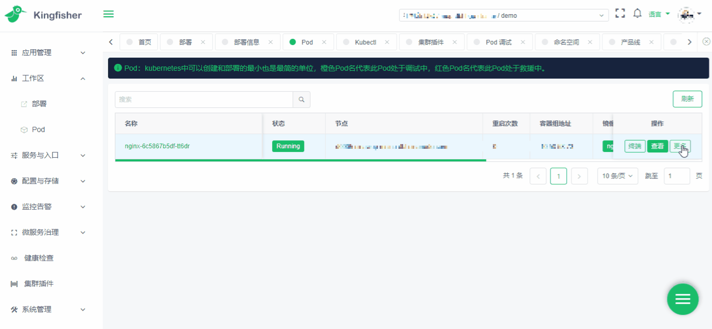

# Kingfisher Pod Debug

在平台页面可以直接调试Pod，被调试Pod不需要做任何修改，调试Pod与被调试Pod具有相同PID、相同网络环境并共享内存空间

## 依赖

- Golang： `Go >= 1.13`

## Makefile的使用

- 根据需求修改对应的REGISTRY变量，即可修改推送的仓库地址
- 编译成二进制文件： make build
- 生成镜像推送到镜像仓库： make push

## 联系我们
- [交流群](https://github.com/open-kingfisher/community/blob/master/contact_us/README.md)
